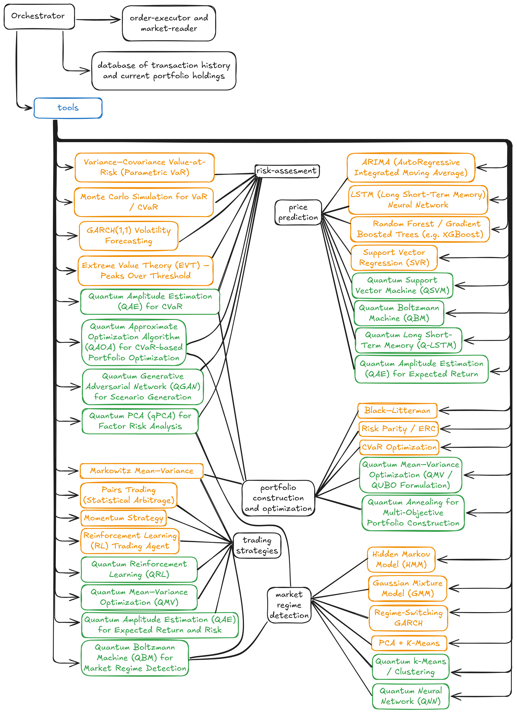

# **Quantum–Classical Hybrid Hedge Fund Architecture**

### **Technical Overview & Guidance Request (Draft for Hedge Fund Manager)**

---

## **1. Purpose of This Document**

This document introduces a **research-first hybrid architecture** combining classical quantitative finance, machine learning, quantum algorithms, and agentic LLM orchestration.

The goal is to seek **expert guidance** on whether the selected tools, models, and design choices are appropriate for **Indian market microstructure**, given that most empirical benchmarks come from **US/EU markets**.

> **This is not a trading bot or forecasting engine.**
> It is a **comparative, evaluative architecture** designed to map:
> **Market Regime → Algorithm Performance → LLM Tool-Selection Reasoning.**

---

## **2. What This Project Is (and Is Not)**

### **This Project *Is***

* A **comparative study** of classical, ML, and quantum tools under different market regimes.
* A platform for understanding **how LLM agents select tools** based on context.
* A **research benchmark** for hybrid AI + quantum quant workflows.
* A system with **complete reproducibility** (MLflow, TimescaleDB).
* A test-bed for **market-regime-aware modelling**.

### **This Project Is *Not***

* A retail stock prediction model.
* A typical ML-based market forecasting system.
* A plug-and-play trading bot.

**The novelty lies in meta-analysis and orchestration, not raw prediction.**

---

## **3. High-Level Architecture Overview**

This architecture mirrors the structure described in the previous proposal, including all major tool families and the full agentic pipeline.

### **3.1 Orchestrator (Agentic LLM Layer)**

* Reads market conditions
* Selects appropriate tools from the registry
* Runs experiments
* Logs decisions, reasoning traces, and outcomes
* Manages reproducibility and workflow

### **3.2 Tool Registry (Classical + ML + Quantum)**

* **Risk Tools**

  * VaR, CVaR
  * GARCH family
  * Monte Carlo
  * *Quantum:* Quantum Amplitude Estimation (QAE)

* **Price/Return Models**

  * ARIMA
  * LSTM
  * XGBoost
  * *Quantum:* QSVM, QGAN

* **Portfolio Optimization**

  * Markowitz
  * HRP
  * CVaR optimization
  * *Quantum:* QAOA, QMV, D-Wave solvers

* **Market Regime Detection**

  * HMM, GMM
  * Regime-switching GARCH
  * PCA + K-Means
  * *Quantum:* qPCA, Quantum Boltzmann Machine (QBM)

* **Trading Strategy Modules**

  * Momentum
  * Pairs trading
  * Reinforcement Learning
  * *Quantum RL* (QRL)

### **3.3 Experimental Engine**

* Runs all tools across various historical regimes
* Measures performance (Sharpe, Sortino, VaR/CVaR, drawdowns, stability)
* Records tool–regime–performance mappings
* Stores LLM tool-selection decisions

---

## **4. Objectives (Reframed for Market Guidance)**

### **4.1 Validate Tool Suitability for Indian Markets**

Determine whether the selected classical and quantum algorithms behave consistently under:

* Indian volatility structures
* Liquidity constraints
* High retail participation
* Sectoral cyclicity
* Commodity sensitivity
* Regulatory environments (SEBI)

### **4.2 Assess Market Regime Definitions**

Evaluate whether current regime definitions (bull, bear, volatile, neutral) need:

* India-specific clusters
* Macro overlays (RBI cycles, crude oil sensitivity, USDINR influence)

### **4.3 Evaluate the Agentic LLM Decision Layer**

Does the agentic LLM-driven tool-selection workflow reflect realistic hedge fund thought processes?

### **4.4 Identify Missing India-Specific Components**

For example:

* FII/DII net flow signals
* Liquidity fragmentation across NSE/BSE
* Corporate governance idiosyncrasies
* Regulatory circuit-breakers
* Event-driven patterns (budget, monsoon, elections)

### **4.5 Ensure Academic + Practical Relevance**

Confirm the architecture holds research value while remaining aligned with practical, institutional workflows.

---

## **5. System Modules (From the Original Architecture)**

### **5.1 Market Data Ingestion**

* Equity, ETF, index data (daily + intraday)
* Macro data sources
* TimescaleDB for time-series
* Prefect for orchestration

### **5.2 Risk Assessment**

Classical:

* VaR, CVaR
* GARCH/EGARCH/TGARCH
* Monte Carlo

Quantum:

* Quantum Amplitude Estimation (QAE) for VaR/CVaR
* Variational Quantum Risk models

### **5.3 Price/Return Modelling**

* ARIMA
* LSTM
* XGBoost
* QSVM
* QGAN

### **5.4 Portfolio Construction & Optimization**

* Markowitz
* Risk Parity / HRP
* CVaR optimization
* QAOA for optimization
* Quantum Mean-Variance Optimization (QMV)

### **5.5 Market Regime Detection**

* HMM, GMM
* Regime-Switching GARCH
* PCA + K-Means
* Quantum PCA
* Quantum Boltzmann Machine

### **5.6 Trading Strategy Testing**

* Momentum-based
* Mean reversion
* Statistical arbitrage (pairs trading)
* RL Agents
* Quantum RL (QRL)

### **5.7 Logging & Benchmarking Layer**

* MLflow
* TimescaleDB
* Grafana dashboards
* Full experiment lineage tracking

---

## **6. Experimental Design**

### **6.1 Dataset Selection**

10–20 years of daily + intraday Indian equities and ETFs.

### **6.2 Regime Labelling**

* Volatility clustering (HMM / RS-GARCH)
* Macro validation (VIX India, yield curve, FII flows)

### **6.3 Tool Evaluation Loop**

For each regime:

* Run all relevant tools
* Compare performance metrics
* Log results, intermediate computations, and LLM reasoning

### **6.4 LLM Tool Selection**

The agent receives:

* Recent features
* Historical performance
* Regime labels

It selects a tool or combination and logs:

* **Why the tool was chosen**
* **How this impacted results**

### **6.5 Comparative Analysis Output**

A 3D mapping:
**(Regime) → (Tool Selected) → (Performance Profile)**

---

## **7. Questions for the Hedge Fund Manager**

### **7.1 Algorithm Suitability**

* Are GARCH, RS-GARCH, HMM, EVT, QAOA, QAE meaningful in India’s market structure?
* Do Indian markets require additional pre-processing or constraints?

### **7.2 Regime Definitions**

* Are our definitions appropriate?
* Should India-specific labels (e.g., “FII outflow panic”) be included?

### **7.3 Risk Metrics**

Beyond Sharpe/Sortino/VaR, do Indian desks rely on:

* Modified VaR
* Conditional Drawdown
* Drawdown Duration
* Liquidity-adjusted VaR?

### **7.4 Agentic LLM Layer**

Is this multi-tool orchestration useful in a real hedge fund workflow?

### **7.5 Quantum Layer Integration**

Where do you see quantum components meaningfully contributing, given:

* Indian asset universe
* Typical hedge fund timelines
* Data availability
* Hardware constraints?

---

## **8. Conclusion**

We are building a **research-grade comparative architecture**, not a predictive product.
Your guidance on the Indian market’s structural characteristics, volatility patterns, and risk nuances will shape the evolution of this hybrid system.

We appreciate your time and expertise, and look forward to refining the architecture based on your insights.
